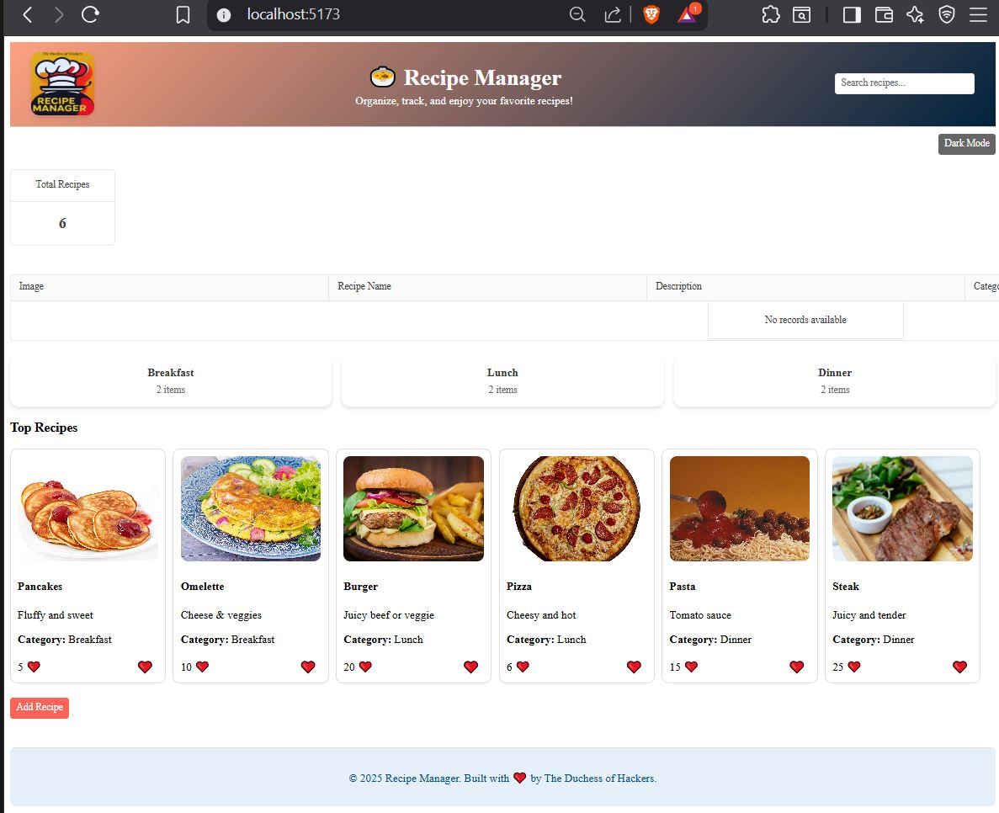

# 🍲 Recipe Manager

A simple and interactive **React** app to manage your favorite recipes.  
Organize, track, and enjoy recipes with a modern UI and dark mode support.

---

##  Features

- Add, edit, and delete recipes easily
- Filter recipes by **Breakfast**, **Lunch**, or **Dinner**
- View top recipes at a glance
- **Stats card** showing total recipes
- Toggle **Dark Mode**
- Responsive design

---

##  Built With

- **React**
- **KendoReact Components**:
  1. Buttons (`@progress/kendo-react-buttons`)
  2. Inputs (`@progress/kendo-react-inputs`)
  3. Dialogs (`@progress/kendo-react-dialogs`)
  4. Notifications (`@progress/kendo-react-notification`)
  5. Charts (`@progress/kendo-react-charts`)
  6. Grid (`@progress/kendo-react-grid`)
  7. DropDowns / Selects (`@progress/kendo-react-dropdowns`) – used in RecipeFilter
  8. Card (`@progress/kendo-react-layout`) – for StatsCard / CategoryCard / RecipeCard
  9. Loader / Progress (`@progress/kendo-react-indicators`) – optional if added for loading states
  10. Tooltip (`@progress/kendo-react-tooltip`) – optional if used for hover hints

- **CSS** for custom styling and dark mode
- **JavaScript ES6+**

---

##  Screenshot



---

##  Getting Started

1. Clone the repository:  
```bash
git clone https://github.com/yourusername/recipe-manager.git
````

2. Navigate into the folder:

```bash
cd recipe-manager
```

3. Install dependencies:

```bash
npm install
```

4. Run the app:

```bash
npm start
```

Visit `http://localhost:3000` in your browser.

---

##  Usage

* Click **Add Recipe** to add a new recipe.
* Edit or delete recipes from the recipe list.
* Filter recipes by category.
* Toggle **Dark Mode** using the button.

---

##  License

Made with ❤️ by The Duchess of Hackers

